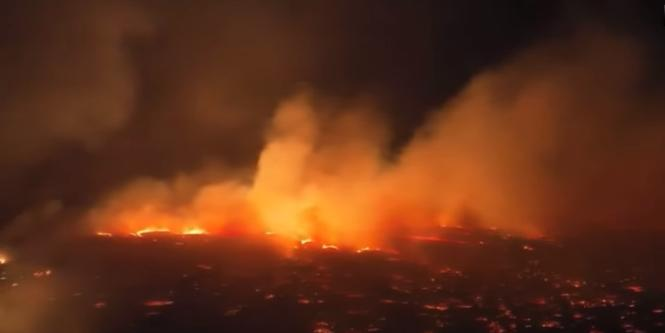

## Headlines

1. Six people have been killed in wildfires in Maui.
2. Broadband internet outage across Hawaii.
3. Violent wind across Hawaii from Maui burning.
4. 150,000 gallons of water spray dropped yet to stop burning but no outcome yet.
5. US Miltery top on the race to deploy firefighters to save Maui and Big Islands.
6. Copast guards from US is saving life to do water rescue.
7. People run into the ocean to save life.
8. Fires is continuing and not under control.
9.  

### Overview

In Maui, where wildfires have killed at least six people. In Maui County, violent and explosive wildfires have torn through the island of Maui, destroying homes and businesses. The fire is being fueled by a hurricane 800 miles away interrupted. So suddenly people had to run into the ocean to escape the fire and then later be rescued. 

We just heard from authorities in Hawaii that they still say the fire is still burning and it's likely to continue as well. we still have the indirect impacts from Hurricane Dora and high pressure system to the north. So what it's doing is it's putting the squeeze right on the Hawaiian Islands and allowing those winds out of the east to gust just after checked over 40 miles per hour in some of those locations. That's going to obviously complicate fire efforts. But look at the image that you're seeing on your screens right now.

This is imperative because the fire that impacted the west side of Maui, the the location, the economic hub of Miami, where all the resorts and businesses are generally located, where people go as tourists to visit Well, the fire ran out of room to burn. Literally moving into the ocean as it literally had nothing else to char. But it was just incredibly harrowing moments. There were adjectives used like dire and apocalyptic. And you can see exactly why with some of these first aerial visuals that we are getting now, everyone in Hawaii knows how to handle a hurricane. Everyone knows how to handle a volcano as well, as difficult as it can be. But this caught people off guard. As a meteorologist, we were watching Hurricane Dora slide well south of the island chain. It wasn't a concern for us. We thought it was fish food, literally not impacting land. But the fact is that it created a phenomenon with the winds that no one could have foreseen. And it caught people off guard in the middle of the night when people were sleeping. So you can imagine just how terrifying those moments were overnight when we started to see those little flash points, the little hot spots on satellite imagery that meteorologists look at. We started to see those flare up and that was a concern. 

And we immediately started to recognize that there was a problem. Social media videos start pouring in and then we start to learn about the communications going down, 911 not becoming available for residents over the western side. Of the island of Maui. Think how concerning and how terrifying those moments must have been for people not being able to reach out for help. Well, that's what people had to endure. Their turn down there. And Dan, thank you so much. Joining us now, Quentin Cochise, the president of Blue Hawaiian Helicopters, a helicopter tourism company, and Quentin you suspended operations to use your helicopter fleet to help get food, water and other supplies into areas of Maui that are the hardest hit. 

