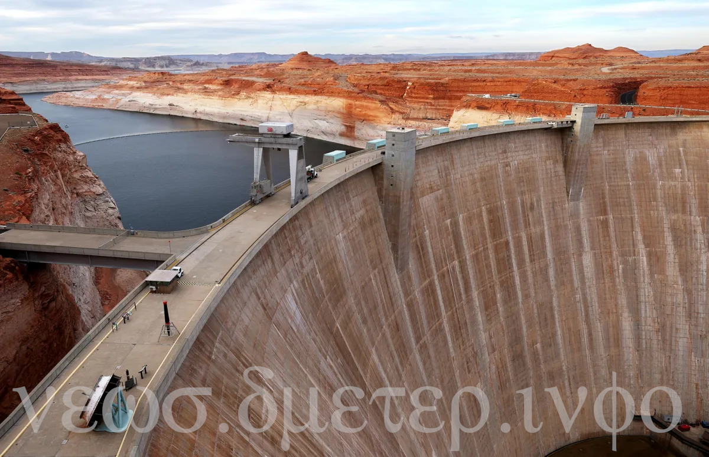

## How Lake Mead and Lake Powell Water Levels Are Changing and Why It Matters

Lake Mead and Lake Powell are two of the largest reservoirs in the United States and the main storage units of the Colorado River system, which provides water to about 40 million people and 5.5 million acres of farmland in seven states and Mexico. However, both lakes have been suffering from a prolonged drought that has reduced their water levels to historically low levels, threatening the water supply, hydropower generation, recreation and ecosystem of the region. In this blog post, we will look at how the water levels of Lake Mead and Lake Powell have changed over time, what are the causes and consequences of these changes, and what are the possible solutions to address this challenge.

### How have the water levels changed?
According to the data from the Bureau of Reclamation (BOR), which manages both reservoirs, Lake Mead and Lake Powell have experienced a significant decline in their water levels since 2000, when they were both near full capacity. The decline was mainly driven by a combination of low precipitation, high evaporation, increased water demand and reduced inflow from upstream tributaries. As of August 16, 2023, Lake Mead's water level was at 1,075 feet above sea level, which is about 145 feet below its full capacity of 1,220 feet. Lake Powell's water level was at 3,574 feet above sea level, which is about 125 feet below its full capacity of 3,700 feet.

The water levels of both lakes fluctuate seasonally and annually depending on the hydrological conditions and the water management policies. For example, in 2023, both lakes saw an improvement in their water levels due to above-average precipitation and snowpack that melted throughout the summer. However, this improvement was not enough to reverse the long-term trend of decline. In fact, the BOR projected that both lakes will continue to drop in the next two years, reaching 1,065 feet for Lake Mead and 3,525 feet for Lake Powell by January 1, 2024.

### Why do the water levels matter?
The water levels of Lake Mead and Lake Powell have significant implications for various aspects of the region's economy, environment and society. Here are some of the main impacts:

- Water supply: The Colorado River system supplies water to about 40 million people and 5.5 million acres of farmland in Arizona, California, Colorado, Nevada, New Mexico, Utah and Wyoming, as well as Mexico. The lower the water levels of Lake Mead and Lake Powell are, the less water is available for these users. Moreover, the lower water levels also increase the salinity and reduce the quality of the water.
- Hydropower generation: The Hoover Dam on Lake Mead and the Glen Canyon Dam on Lake Powell are two of the largest hydropower plants in the country, producing electricity for millions of homes and businesses in the Southwest. The lower the water levels of Lake Mead and Lake Powell are, the less power they can generate. For example, according to the BOR, if Lake Mead drops below 1,050 feet, it would lose about 25% of its power output. If it drops below 900 feet, it would stop producing power altogether.
- Recreation: Lake Mead and Lake Powell are popular destinations for boating, fishing, camping and other recreational activities that generate millions of dollars in revenue and support thousands of jobs in the region. The lower the water levels of Lake Mead and Lake Powell are, the less attractive they are for visitors. For example, according to a study by Arizona State University¹, every foot drop in Lake Mead's water level reduces its economic value by $6.4 million.
- Ecosystem: The Colorado River system supports a rich biodiversity of fish, wildlife and plants that depend on its flow regime, temperature and quality. The lower the water levels of Lake Mead and Lake Powell are, the more they alter these ecological conditions and threaten the survival of many species. For example, according to a report by American Rivers², four native fish species in the Colorado River basin are endangered or threatened due to habitat loss, fragmentation and degradation caused by dams and diversions.

### What are the possible solutions?
To address the challenge of declining water levels in Lake Mead and Lake Powell, there is no single or easy solution. Rather, it requires a combination of short-term and long-term measures that involve cooperation among various stakeholders at local, state, federal and international levels. Some of these measures include:

- Conservation: One of the most effective ways to save water is to use less of it. This can be achieved by implementing various conservation practices such as installing low-flow fixtures, replacing turf with drought-tolerant landscaping,
recycling wastewater,
using drip irrigation,
and educating consumers about water efficiency.
- Innovation: Another way to save water is to use it more wisely. This can be achieved by applying various technological innovations such as remote sensing, artificial intelligence, smart meters, leak detection, and water trading that can help optimize water allocation, distribution and management.
- Adaptation: A third way to save water is to adapt to the changing conditions. This can be achieved by adjusting various policies and regulations such as water rights, pricing, allocation, transfers, and governance that can help balance the competing demands and interests of different water users and sectors.
- Collaboration: A fourth way to save water is to work together. This can be achieved by fostering various forms of collaboration such as agreements, partnerships, coalitions, and dialogues that can help build trust and cooperation among different stakeholders across borders and boundaries.

### Conclusion
Lake Mead and Lake Powell are two of the most important reservoirs in the United States and the main storage units of the Colorado River system, which provides water to millions of people and acres of farmland in the region. However, both lakes have been facing a severe drought that has reduced their water levels to historically low levels, threatening the water supply, hydropower generation, recreation and ecosystem of the region. To address this challenge, there is no single or easy solution. Rather, it requires a combination of conservation, innovation, adaptation and collaboration among various stakeholders at local, state, federal and international levels. By taking these actions, we can ensure the sustainability and resilience of Lake Mead and Lake Powell and the Colorado River system for the present and future generations.

#### Source: 
(1) Charts Show Lake Mead, Powell Water Levels Change Amid Low ... - Newsweek. https://www.newsweek.com/charts-show-lake-mead-powell-water-levels-change-amid-low-storage-warning-1820345.

(2) Federal officials announce 2024 plans for Lake Mead, Lake Powell water use. https://www.ktnv.com/news/federal-officials-announce-2024-plans-for-lake-mead-lake-powell-water-use.

(3) Have Lake Mead Water Levels Stopped Rising? What We Know - Newsweek. https://www.newsweek.com/have-lake-mead-water-levels-stopped-rising-what-we-know-1812582.

(4) Here's how much Lake Mead could rise after an epic winter and new water .... https://www.cnn.com/2023/06/24/us/how-much-lake-mead-water-rise-climate/index.html.
