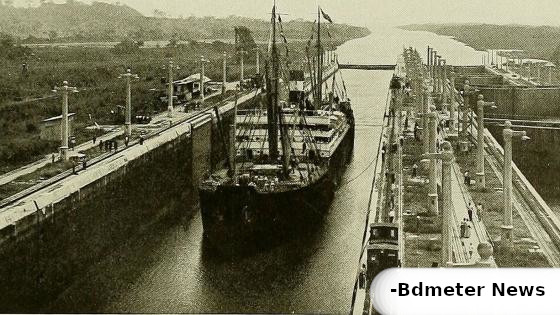
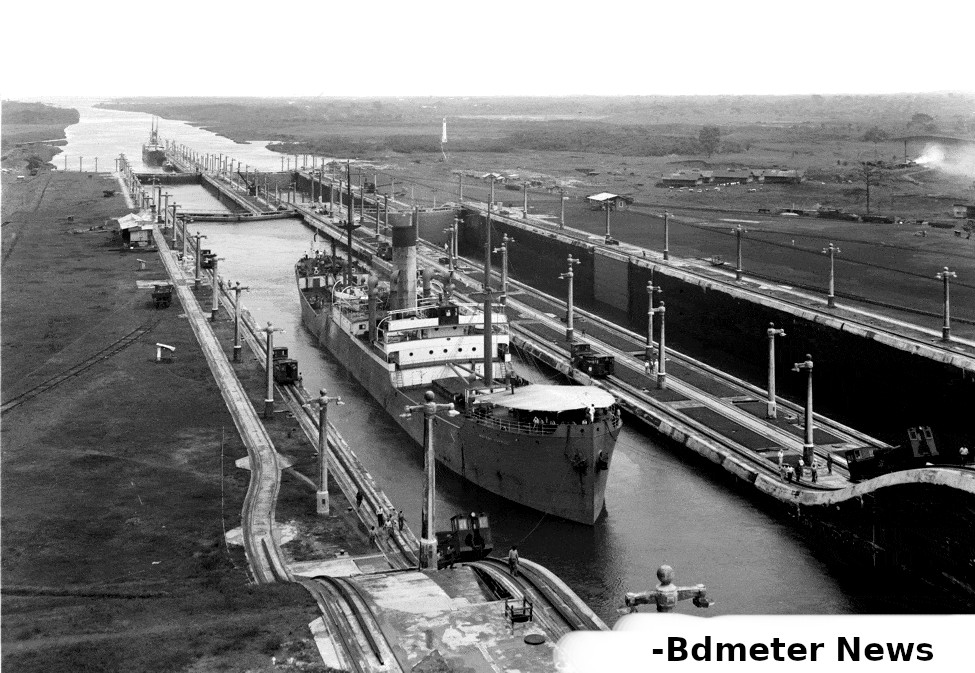
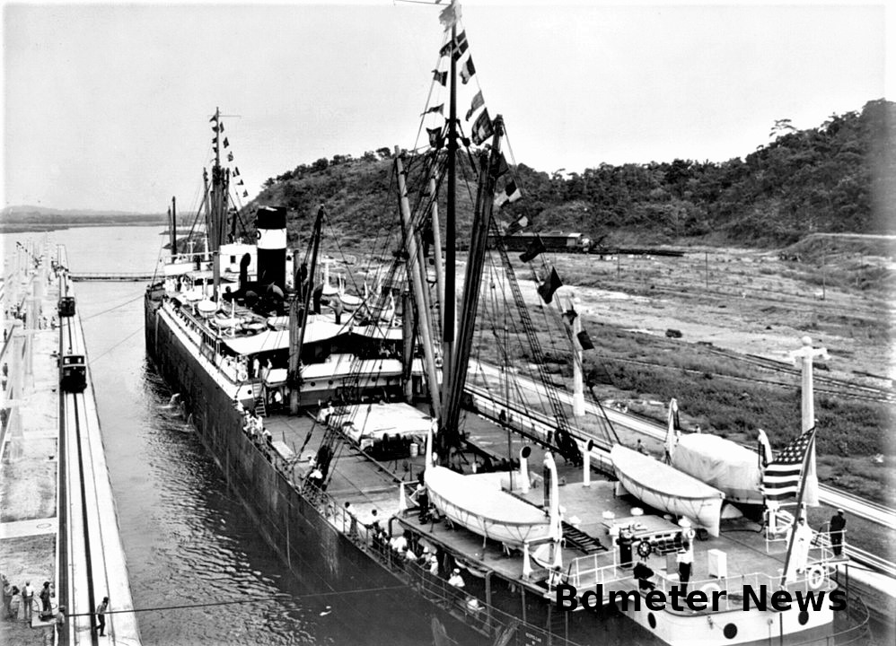

## Global economy crisis due to Panama Canal stoppage

The Panama Canal is one of the most important trade routes in the world, connecting the Atlantic and Pacific oceans and allowing ships to save time and money by avoiding the long detour around South America. However, the Canal is facing a serious challenge due to a severe drought that has reduced the water levels in the artificial lake that supplies the locks that lift and lower the ships. As a result, hundreds of ships are stuck in a massive traffic jam, waiting for their turn to cross the Canal.

The drought is caused by climate change, which has altered the rainfall patterns in Panama, one of the wettest regions on Earth. The Canal relies on rainwater to fill its reservoirs, which are used to operate the locks. Each transit of a ship consumes about 50 million gallons of water, which is released into the ocean. The Canal authority has implemented measures to conserve water, such as recycling some of the water, installing water-saving basins, and imposing restrictions on the size and number of ships that can pass through each day. However, these measures are not enough to cope with the unprecedented dry spell that has lasted for months.

The impact of the drought on the Canal is not only a problem for Panama, but also for the global economy. The Canal handles about 5% of world trade, with more than 12,000 ships passing through each year. The delay in transit affects many industries, such as agriculture, energy, manufacturing, and retail. Some shippers have opted to reroute their vessels around South America or use other modes of transportation, such as rail or air. However, these alternatives are more expensive, time-consuming, and environmentally damaging.

The situation at the Canal highlights the vulnerability of global trade to climate change, which can disrupt supply chains and increase costs and risks. It also underscores the need for more investment in infrastructure and technology to adapt to changing weather conditions and ensure the resilience and sustainability of trade routes. The Canal authority is working on a long-term plan to expand its water sources and increase its storage capacity. It is also exploring the possibility of using renewable energy sources, such as solar and wind power, to operate the locks.

The Panama Canal is a remarkable engineering feat that has transformed global trade for over a century. However, it is also facing a critical test due to climate change, which threatens its viability and efficiency. The drought at the Canal is a wake-up call for the world to take action to mitigate and adapt to the effects of climate change, which can have far-reaching consequences for trade and development.

### WHy this happened in Panama Canal?

The reason behind the Panama Canal drying up is climate change, which has caused a severe drought in Panama, one of the wettest regions on Earth. The Canal depends on rainwater to fill its reservoirs, which are used to operate the locks that lift and lower the ships. However, the rainfall patterns have changed due to global warming, resulting in less water available for the Canal.

To improve the Canal, the Canal authority is working on several measures, such as:

- Recycling some of the water used in each transit, instead of releasing it into the ocean.
- Installing water-saving basins that reduce the amount of water needed for each lock operation by 7%.
- Imposing restrictions on the size and number of ships that can pass through each day, based on the water levels and weather forecasts.
- Expanding its water sources by building new reservoirs and dams, and increasing its storage capacity by raising the level of the existing lake.
- Exploring the possibility of using renewable energy sources, such as solar and wind power, to operate the locks.

These measures aim to conserve water, increase efficiency, and reduce the environmental impact of the Canal. However, they also require significant investment and time to implement. The Canal authority hopes to complete its long-term plan by 2028.

### How to bypass ships stucked in Panama Canal
There are two main ways to bypass the Panama Canal if you want to ship goods from one ocean to the other:

- The first way is to go around South America, either through the Strait of Magellan or Cape Horn. This route is longer, more expensive, and more dangerous than the Canal, as it exposes the ships to rough seas, strong winds, and icebergs. However, some shippers have opted for this alternative to avoid the long delays and restrictions at the Canal due to the drought².
- The second way is to use other modes of transportation, such as rail or air. For example, some shippers have used the intermodal network of railways and highways in North America to transport their goods from the Pacific coast to the Atlantic coast, or vice versa. This option is faster and more reliable than the Canal, but also more costly and less environmentally friendly. Another option is to use air cargo, which is the quickest and most flexible way to move goods across continents, but also the most expensive and limited by capacity².

Both of these ways have their advantages and disadvantages, depending on the type, volume, value, and urgency of the goods being shipped. The Panama Canal remains the most efficient and convenient route for many shippers, but it also faces challenges due to climate change, which can disrupt its operations and affect its competitiveness. Therefore, it is important for shippers to have contingency plans and alternative routes in case of emergencies or disruptions at the Canal.

### History of Panama Canal

The history of the Panama Canal is a fascinating story of human ingenuity, ambition, and perseverance. The Canal is a man-made waterway that connects the Atlantic and Pacific oceans through the narrow Isthmus of Panama. It is one of the most important trade routes in the world, as it allows ships to save time and money by avoiding the long detour around South America. The Canal also has a significant impact on the environment, culture, and politics of Panama and the region.

The idea for a Canal across Panama dates back to the 16th century, when Spanish explorer Vasco Núñez de Balboa became the first European to discover that the Isthmus of Panama was just a slim land bridge separating the Atlantic and Pacific oceans³. The earliest European colonists recognized this, and several proposals for a Canal were made¹. However, it was not until the late 19th century that technological advances and commercial pressure allowed construction to begin in earnest.

The first attempt to build the Canal was led by France, under the direction of Ferdinand de Lesseps, who had successfully built the Suez Canal in Egypt. However, the French project faced many challenges, such as the rugged terrain, tropical diseases, engineering difficulties, and financial scandals. After 10 years of work and the loss of more than 20,000 lives, the French company went bankrupt and abandoned the project in 1889.

The second attempt was led by the United States, which had a strong interest in building a Canal for strategic and economic reasons. The U.S. acquired the rights to the French assets and negotiated a treaty with Colombia, which then controlled Panama, to build and operate the Canal. However, when Colombia rejected the treaty, the U.S. supported a revolution by Panamanian nationalists who declared their independence from Colombia in 1903¹. The U.S. then signed a new treaty with Panama, granting it a perpetual lease on a 10-mile-wide strip of land known as the Canal Zone.

The U.S. project was supervised by John F. Stevens and later George W. Goethals, who made several changes to improve the efficiency and safety of the Canal. They decided to use a lock system instead of a sea-level Canal, which required less excavation and allowed for better control of water levels. They also implemented sanitary measures to combat malaria and yellow fever, which had decimated the French workers. They also used innovative technologies such as steam shovels, dredges, railroads, and concrete mixers to speed up the construction process.

The Panama Canal was completed in August 1914, after 10 years of work and the expenditure of $375 million. It was considered one of the greatest engineering achievements of its time. The Canal was officially opened on August 15, 1914, with the passage of the cargo ship SS Ancon¹. Since then, more than one million vessels have transited through the Canal, carrying more than 14 billion tons of cargo.

The Canal has also been a source of controversy and conflict over its ownership and operation. For many years, Panama resented the U.S. presence and influence in its territory and demanded more sovereignty and benefits from the Canal. After several riots and negotiations, the U.S. and Panama signed two treaties in 1977 that agreed to transfer the control of the Canal to Panama by December 31, 1999. The transfer was completed peacefully and successfully on that date, marking a new era for Panama and its relations with the U.S.

Since then, Panama has been responsible for administering and managing the Canal through an autonomous agency called the Panama Canal Authority (ACP). The ACP has invested in modernizing and expanding the Canal to meet the growing demand and competition from other routes. In 2007, it began a major project to build a third set of locks that can accommodate larger ships with more cargo capacity. The project was completed in June 2016, increasing the Canal's annual revenue by 50%.

The Panama Canal is not only a vital link for global trade but also a symbol of human creativity and cooperation. It is a testament to how people can overcome natural and artificial obstacles to achieve their goals and dreams. It is also a reminder of how people can respect and share their resources for mutual benefit and development.

